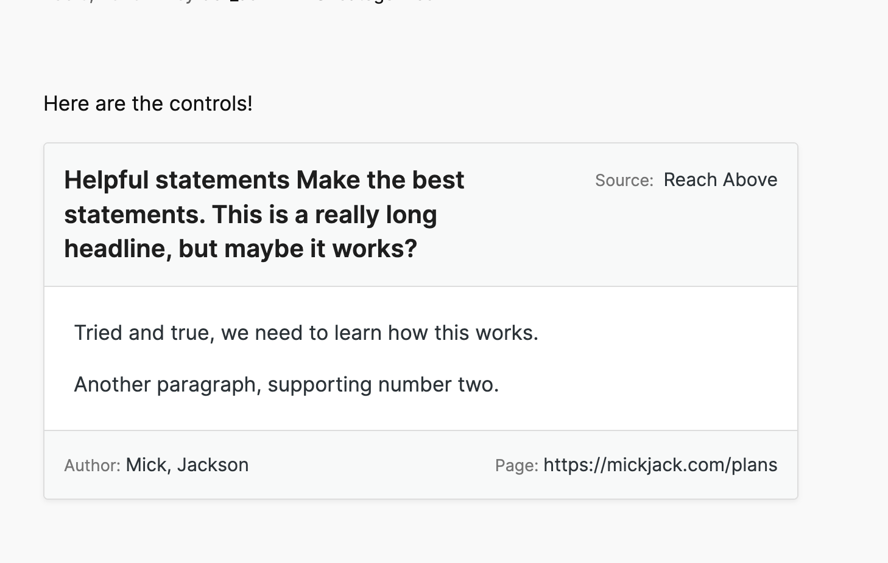

`git checkout 48c51b027502b9659fbbff8c4341087dc5d381d8` - correct branch
- Frontend display isn't as good as I want
- [ ] Find UI display to match [screenshot](https://github.com/flexseth/essay-card-topic-statement-generator/blob/main/screenshot.png)

# Essay Card Topic Statement Generator

A WordPress plugin that adds a Gutenberg block for creating essay notecards with topic statements, supporting text, and MLA citations.



## Description

This plugin provides a custom Gutenberg block that allows users to create digital notecards for essay research. Each notecard includes:

- Topic Statement
- Supporting Text
- Citation Information
  - Source Title
  - Author Name
  - Page Number/URL

## Installation

1. Download the plugin files and extract them to your `/wp-content/plugins/` directory
2. Activate the plugin through the 'Plugins' menu in WordPress
3. The block will be available in the Gutenberg editor under the 'Common' category

### Development Installation

To set up the development environment:

1. Clone this repository to your local machine
2. Navigate to the plugin directory
3. Install dependencies
```bash
npm install
```

4. Start the development environment:
```bash
npm start
```

5. Build for production:
```bash
npm run build
```

## Usage

1. Create a new post or page in WordPress
2. Click the '+' button to add a new block
3. Search for "Essay Notecard" or find it in the Common blocks category
4. Fill in the following fields:
   - Topic Statement: A concise discussion point
   - Supporting Text: Paragraphs supporting your topic
   - Source Information: Publication details for MLA citation

## Features
- Easily create essay research notecards
- Word counter shows how close you are to progress on a topic
- Organize as WordPress posts to step through writing process

## Requirements

- WordPress 5.2 or higher
- PHP 6.0 or higher

## Todo
- Check "Page" field for text or URL & validate 
- Create grid display for notecards
- Add automatic citations based on input fields
- Use Harper to grammar check

## Change log
See CHANGELOG

## License

GPL v2 or later - https://www.gnu.org/licenses/gpl-2.0.html